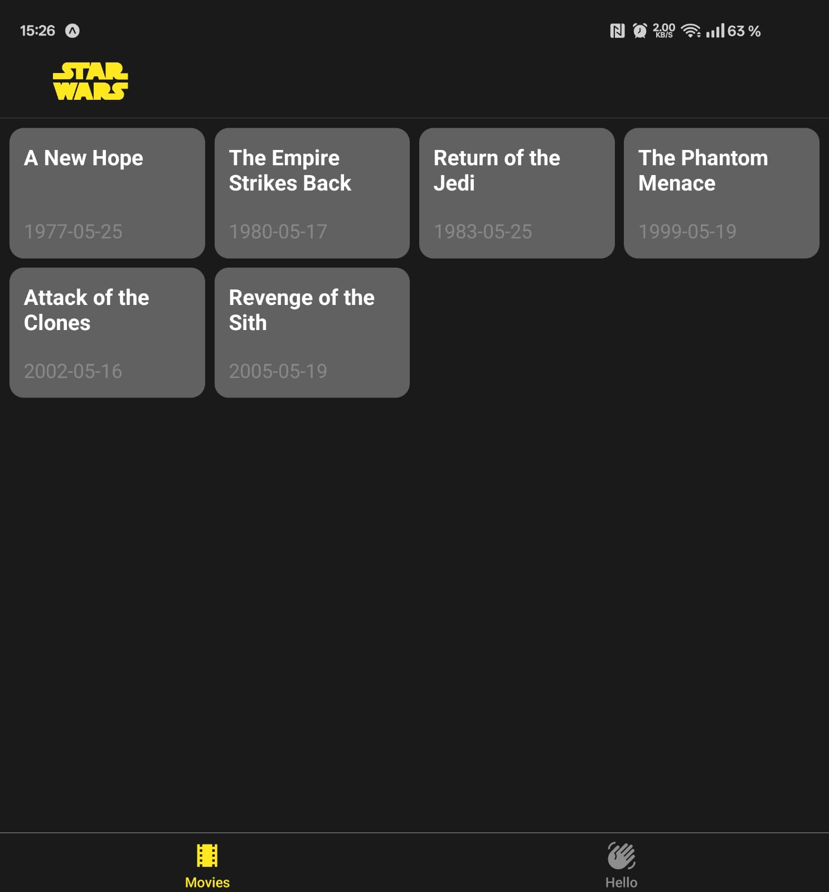

### React Native Star Wars

## Development tools

🚀 This app was developed and tested using:
- Expo Go (run with `npm start`)
- OnePlus Open Android device for testing and development

### Responsiv Design

Applikationen har en responsiv grid-layout som anpassar sig efter olika skärmstorlekar:

- **Mobiltelefon (Standard)**: Visar 2 kolumner för filmer och 3 kolumner för karaktärer
- **Vikbar Telefon (Utvikt)**: Expanderar till 3-4 kolumner för filmer medan karaktärer behåller 3 kolumner

### Visuellt Exempel - Vikbar Telefon Layout (Utvikt) "Upp till 4 kolumner"

## Implementationsbeskrivning
Jag har byggt en Star Wars-applikation med följande huvudkomponenter:

1. **Filmvisning**
   - Implementerat en responsiv grid för filmer
   - Sorterar filmer efter releasedatum
   - Använder FlatList för effektiv rendering
   - Stöd för olika skärmstorlekar med dynamisk kolumnberäkning

2. **Karaktärsvisning**
   - Visar karaktärer i en 3-kolumners grid
   - Top-till-botten ordning enligt specifikation
   - Parallell hämtning av karaktärsdata
   - Animerad laddningsindikator med Star Wars-tema

3. **Felhantering & Laddning**
   - Omfattande felhantering för API-anrop
   - Användarvänliga felmeddelanden
   - Timeout på 10 sekunder för API-anrop
   - Möjlighet att försöka igen vid fel

4. **State Management**
   - Custom hooks för filmdata (useFilms)
   - Custom hooks för karaktärsdata (useCharacters)
   - Optimerad datahämtning

5. **UI/UX**
   - Star Wars-inspirerad design
   - Mörkt tema genomgående
   - Responsiv layout för olika enheter
   - Animationer för bättre användarupplevelse

### Tekniska Val
- React Native med Expo för snabb utveckling
- TypeScript för typsäkerhet
- Jest för enhetstester (begränsad testtäckning)
- Axios för API-anrop
- React Navigation för routing

### Prestanda
- Optimerad rendering med FlatList
- Effektiv bildhantering
- Minnesvänlig implementation
- Parallell hämtning av karaktärsdata med Promise.all

Detta projekt demonstrerar modern React Native-utveckling med fokus på användarupplevelse, prestanda och kodkvalitet.